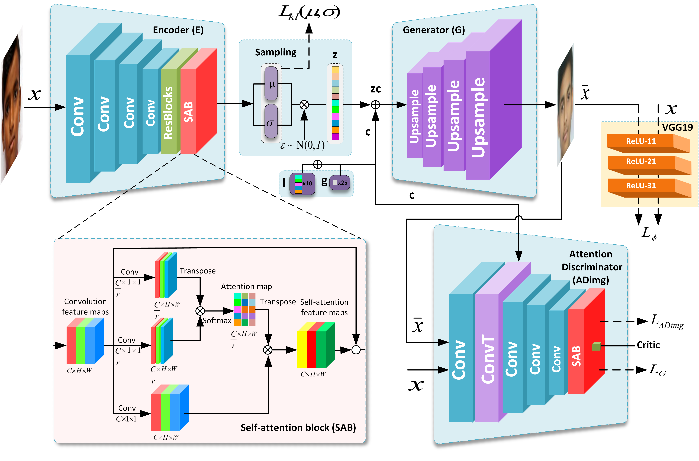

# ChildGAN: Face Aging and Rejuvenation to Find Missing Children

 🤝 Contributors: Praveen Kumar Chandaliya and **Neeta Nain**

# MRCD Dataset Agreement Form
https://github.com/praveenkumarchandaliya/ChildGAN_Tamp1/blob/main/MRCD%20Dataset%20Agreement%20Form.pdf

The images are labeled “age_gender_sequenceID, " where age is the person's age, and gender is the person's id, i.e., 0 or 1. For boys and girls, 0 and 1 are used as gender id, respectively.

# Institution
Multi-Racial Child Dataset is developed at the Department of Computer Science and Engineering of the **Malaviya  National Institute of Technology Jaipur** as part of a research project under grant No. 4 (13)/2019-ITEA by the **Ministry of Electronics and Information Technology (MeitY), Government of India**. 

## 🙏 Acknowledgements and Research Grant
This research is based upon work supported by the Ministry of Electronics and Information Technology (MeitY), Government of India, under Grant No. 4 (13)/2019-ITEA. We gratefully acknowledge the support of NVIDIA Corporation with the donation of the TITAN V GPU used for this research. We are also grateful to Cognitec with the donation of the FaceVACS-DBScanID5.6 software for this work.

# Description of MRCD dataset:  
The MRCD contains 64,965 child face images from four racial groups: Asian, Black, White, and Indian.

Dataset distribution: Asian (17,211), Black (13,354), White (19,297), Indian (15,103).

All images are resized to 128 × 128 pixels with 72–96 DPI resolution.

The dataset is intended only for academic and research purposes.

Images are labeled as **age_genderId_sequenceID**, where genderId = 0 (boy) and 1 (girl).

Asian, Black, and White subsets are used to train the ChildGAN model using publicly available and web-crawled data.

More implementation and ethical details are provided in the associated publications.

# 📂 Directory structure: <br />

(root)<br/>
├── Asian/<br/>
│   ├── 00/ → 0–3 Years Boys<br/>
│   ├── 01/ → 0–3 Years Girls<br/>
│   ├── 02/ → 4–8 Years Boys<br/>
│   ├── 03/ → 4–8 Years Girls<br/>
│   ├── 04/ → 9–12 Years Boys<br/>
│   ├── 05/ → 9–12 Years Girls<br/>
│   ├── 06/ → 13–16 Years Boys<br/>
│   ├── 07/ → 13–16 Years Girls<br/>
│   ├── 08/ → 17–20 Years Boys<br/>
│   └── 09/ → 17–20 Years Girls<br/>
│<br/>
├── Black/<br/>
│   └── (same structure as above)<br/>
│<br/>
└── White/<br/>
    └── (same structure as above)<br/>


 
# Dataset link for download: <br/>
<a href="https://drive.google.com/file/d/1_jOclJy3AFbSHzKsuIh7QD-UOsb5p2RT/view?usp=drive_link">MRCD Dataset<a>


### Introduction

This repo is the official Pytorch implementation for our paper ChildGAN: Face Aging and Rejuvenation to Find Missing Children.

<div align="center">

</div>
<div align="center">
Model Architecture.
</div>
<br/>

### ⚙️ Requirement

- Python 2.7 or higher
- Pytorch 

### 🚀 Training and Testing ChildGAN

1. Train Model: `ChildGANTrain.py` file.

2. Test  Model: `ChildGANTest.py` file.

### Generalization Result

<div align="center">

</div>
<div align="center">
Age progressed faces on four race (a) Asian, (b) Black, (c) White and (d) Indian.
</div>
<br/>

## MRCD Dataset
MRCD Dataset present in CRFW directory: https://github.com/praveenkumarchandaliya/ChildGAN_Tamp1/tree/main/CRFW

## 📎 Related Article and Citation
[Praveen Kumar Chandaliya](https://scholar.google.com/citations?user=cx-vENIAAAAJ&hl=en) and [Neeta Nain](https://scholar.google.com/citations?user=CWsTU7EAAAAJ&hl=en). ChildGAN: Face aging and rejuvenation to find missing children. Journal of Pattern Recognition Elsevier, 2022 <br/> 
DOI: https://doi.org/10.1016/j.patcog.2022.108761   <br/>
ResearchGate: https://www.researchgate.net/publication/360289072_ChildGAN_Face_Aging_and_Rejuvenation_to_Find_Missing_Children.
```
@inproceedings{PraveenICD2022,
  title={ChildGAN: Face aging and rejuvenation to find missing children},
  author={Praveen Kumar Chandaliya, Neeta Nain},
  booktitle={Pattern Recognition},
  year={2022},
  volume = {129},
  pages = {108761}
}
@inproceedings{PraveenICD2022,
  title={Conditional Perceptual Adversarial Variational Autoencoder for Age Progression and Regression on Child Face},
  author={Praveen Kumar Chandaliya, Neeta Nain},
  booktitle={International Conference on Biometrics (ICB)},
  year={2019},
  pages = {1-8},
  doi={10.1109/ICB45273.2019.8987410}
}

@inproceedings{PraveenSAMSP2021,
  title={Child Face Age Progression and Regression using Multi-Scale Patch GAN},
  author={Praveen Kumar Chandaliya, Neeta Nain},
  booktitle={International Joint Conference on Biometrics (IJCB)},
  year={2021},
  pages = {1-8}
}

@inproceedings{AWGAN2022,
  title={AWGAN: Face Age Progression and Regression using Attention},
  author={Praveen Kumar Chandaliya, Neeta Nain},
  booktitle={Neural Computing and Applications},
  year={2022},
  volume = {34},
  pages = {1-16}
}

 

```


